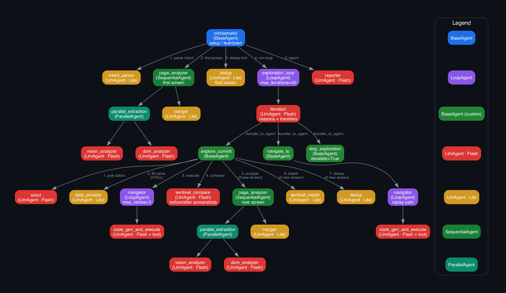

# UI Navigator ☸️

An autonomous AI agent that explores, understands, and tests web applications — powered by Google Gemini and ADK.

## What It Does

Give it a URL. It explores the entire application autonomously:
1. **Page Analyzer** — Gemini Flash sees every screen (screenshot + DOM) and identifies all interactive elements
2. **Navigator** — Gemini generates Playwright code on the fly (no predefined scripts)
3. **Sentinel** — Compares before/after screenshots to understand what changed
4. **Scout** — Strategically decides what to explore next
5. **Pattern Dedup** — Detects repeated UI structures (product grids, list items) and only tests representative samples

The result: a complete navigation map of the application with every screen, every action, and every flow documented.

## Architecture



**27 nodes** — hub-and-spoke architecture where all agent communication flows through the Orchestrator.

### Agents
- **Orchestrator** — BaseAgent hub: setup, teardown, exploration loop
- **Iteration** — Strategic reasoning + `transfer_to_agent` routing (Gemini Flash)
- **Scout** — Action selection strategy, picks next action to explore (Gemini Flash)
- **Page Analyzer** — 👁️ Sends screenshot as inline image to Gemini for UI element extraction + parallel DOM analysis (Gemini Flash + Lite)
- **Sentinel** — 👁️ Sends before/after screenshots as image pairs to Gemini for visual state change detection + screen matching (Gemini Flash + Lite)
- **Navigator** — Dynamic Playwright code generation + execution with retries (Gemini Flash)
- **Data Provider** — Test data generation for form fills (Gemini Lite)
- **Dedup** — Pattern detection, skips duplicate UI elements (Gemini Lite)
- **Reporter** — Post-exploration analysis and report generation (Gemini Flash)

### Key Features
- **Dynamic Tool Generation** — Navigator generates Playwright code at runtime instead of using predefined tool schemas
- **Action Groups** — Batches related actions (form fills) for 3-5x speed improvement
- **Pattern Dedup** — 90 product card actions → 6 representatives tested, 84 inherited
- **Visual Fingerprinting** — Identifies screens by what they LOOK LIKE, not DOM hash
- **Scrollability Detection** — Vision-based detection of scrollable content

## Tech Stack

| Component | Technology |
|---|---|
| Agent Framework | Google ADK (Python) |
| AI Models | Gemini 3 Flash (vision, code gen) + Gemini 3.1 Flash Lite (parsing) |
| Web Automation | Playwright (headless Chromium) |
| State Storage | Cloud Firestore |
| Artifacts | Cloud Storage |
| API | FastAPI + uvicorn |
| Deployment | Cloud Run |

## Quick Start

### Prerequisites
- Python 3.11+
- Google Cloud project with Gemini API enabled
- Firestore database

### Setup
```bash
cd ui-navigator

# Install dependencies
pip install -r requirements.txt
playwright install chromium

# Configure
cp .env.example .env
# Edit .env with your GCP project ID and Gemini API key

# Run via ADK Dev UI (recommended — shows agent graph + traces)
adk web src/agents

# Run via CLI
python -m src.main https://www.saucedemo.com

# Run via API
uvicorn src.api:app --host 0.0.0.0 --port 8080
```

### Docker
```bash
docker build -t ui-navigator .
docker run -p 8080:8080 --env-file .env ui-navigator
```

### Deploy to Cloud Run

**One-command deploy** (enables APIs, builds, deploys, verifies health):
```bash
./deploy.sh --project your-gcp-project
```

**CI/CD** — `cloudbuild.yaml` is included for automated deployment via Cloud Build triggers (auto-deploys on push to main).

**Manual deploy:**
```bash
gcloud run deploy ui-navigator \
  --source . \
  --region us-central1 \
  --memory 2Gi \
  --timeout 300 \
  --set-env-vars "GOOGLE_API_KEY=your-key,GCP_PROJECT_ID=your-project"
```

### API Endpoints
```
POST /explore     — Start autonomous exploration { "url": "https://..." }
GET  /health      — Health check
GET  /runs        — List recent runs
GET  /runs/{id}   — Get full run details (screens, actions, edges)
```

## How It Works

### Exploratory Mode (Main Loop)
```
Orchestrator
  → Iteration Agent (strategic reasoning — explore / navigate / stop?)
    → explore_current:
        Scout (pick action) → Data Provider (fill values)
        → Navigator (generate + execute Playwright code)
        → Sentinel (compare before/after screenshots)
        → if new screen: Page Analyzer (vision + DOM) → Dedup
    → navigate_to:
        BFS path finding → Navigator (replay action chain)
    → stop_exploration:
        All screens explored — exit loop
  → Reporter (generate exploration report)
```

### Architecture Decisions
- **Vision-first state identity** — DOM is unreliable (scroll = new DOM nodes but same page). Gemini vision determines screen identity.
- **Hub-and-spoke** — All agents communicate through Orchestrator. No direct agent↔agent calls.
- **Mobile-ready** — Architecture supports Appium as drop-in executor replacement (not implemented in MVP).

## Project Structure
```
ui-navigator/
├── src/
│   ├── agents/          # ADK agent definitions (15 nodes)
│   ├── tools/           # Firestore + GCS tool functions
│   ├── models/          # Pydantic data models (Screen, Action, NavEdge)
│   ├── sandbox/         # Playwright code execution environment
│   ├── api.py           # FastAPI endpoints for Cloud Run
│   ├── main.py          # ADK runner entry point
│   └── config.py        # Environment-driven configuration
├── docs/
├── Dockerfile
├── cloudbuild.yaml      # Cloud Build CI/CD pipeline
├── deploy.sh            # One-command deployment script
└── requirements.txt
```

## Built For

Google AI Hackathon — UI Navigator ☸️ track.

**Mandatory Requirements:**
- ✅ Gemini model (Flash + Flash Lite)
- ✅ Google ADK (Agent Development Kit)
- ✅ Google Cloud service (Cloud Run + Firestore + Cloud Storage)
